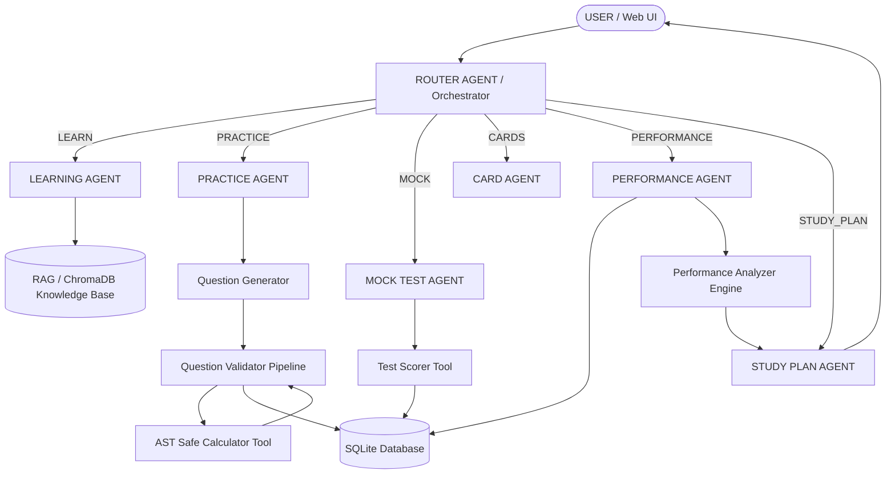

# Multi-Agent Aptitude Preparation System ⚡

A production-quality, extensible AI platform designed for competitive aptitude preparation powered by **Google Gemini**, **LangChain**, **LangGraph**, **RAG (ChromaDB)**, **AST Safe Calculator**, **SQLAlchemy**, **FastAPI**, and a modern **Glassmorphism Web Dashboard**.

---

## 📌 Project Overview & Problem Statement

Standard online preparation tools rely on static question banks or single-prompt LLM wrappers. These traditional approaches suffer from two main flaws:
1. **Mathematical Inaccuracy**: Plain LLM generation can output faulty arithmetic or wrong options.
2. **Lack of Personalization**: Static test banks do not adaptively adjust daily study plans based on performance data across quantitative, reasoning, and verbal topics.

This project solves these limitations by implementing a true **Multi-Agent Architecture** orchestrated via **LangGraph**. The system coordinates specialized agents for Learning, Practice Question Generation, Question Validation, Timed Mock Testing, Flashcard Management, Performance Analytics, and Adaptive Study Planning.

---

## 🏗️ System Architecture & Workflow



---

## 🤖 Specialized Agents & Tech Stack

### 1. Router Agent / Orchestrator (`app/agents/router_agent.py`)
Classifies natural language requests into `LEARN`, `PRACTICE`, `MOCK`, `CARDS`, `PERFORMANCE`, or `STUDY_PLAN`, extracting topic, category, difficulty, and question counts.

### 2. Learning Agent (`app/agents/learning_agent.py`)
Generates 11-section structured lessons (Overview, Definition, Core Concepts, Formulas, Worked Examples, Shortcuts, Common Mistakes, Exam Tips, Practice MCQs, Follow-ups). Leverages RAG via ChromaDB vector retrieval.

### 3. Practice Agent & Validation Pipeline (`app/agents/practice_agent.py`, `app/tools/question_validator.py`)
Generates practice MCQs using Pydantic structured output. Every question passes through a strict validation pipeline:
- Exactly 4 unique options (`option_a` through `option_d`).
- Exactly 1 valid correct option key.
- Explanation agreement check.
- **AST Calculator Verification**: Validates numerical equations in explanations using Python `ast` parsing without unsafe `eval()`.

### 4. Mock Test Agent & Scorer (`app/agents/mock_agent.py`, `app/tools/scoring.py`)
Supports 5, 10, 20, 30, and 50 question mock tests with countdown timers. Answers are hidden during test creation and evaluated upon submission to calculate topic-wise/difficulty-wise accuracy and strong/weak topics.

### 5. Flashcard Agent (`app/agents/card_agent.py`)
Generates and retrieves Formula, Shortcut, Concept, Vocabulary, and Mistake flashcards for revision.

### 6. Performance Agent (`app/agents/performance_agent.py`, `app/tools/performance.py`)
Tracks every attempt in SQLite. Applies configurable attempt thresholds (`MIN_ATTEMPTS_FOR_WEAK_ANALYSIS`) to prevent misclassifying weak topics based on tiny sample sizes.

### 7. Study Plan Agent (`app/agents/study_plan_agent.py`)
Generates personalized, adaptive daily study plans prioritizing weak topics first, followed by formula revision and timed mock practice.

---

## 🛠️ Safe Calculator Tool (`app/tools/calculator.py`)

Does **NOT** use unsafe `eval()`. Parses mathematical expressions into an Abstract Syntax Tree (AST) supporting:
- Arithmetic: `+`, `-`, `*`, `/`, `%`, `^`
- Functions: `sqrt`, `abs`, `avg`, `ncr`, `npr`, `percent`, `percent_of`, `percent_change`.

---

## 🌐 RAG Pipeline (`app/rag/`)

Indexes structured educational markdown files in `knowledge_base/`:
- `knowledge_base/quantitative/` (Percentage, Profit & Loss, Ratio, Time & Work, Probability)
- `knowledge_base/reasoning/` (Number Series, Coding-Decoding)
- `knowledge_base/verbal/` (Vocabulary, Grammar)

Uses ChromaDB (`data/chroma_db`) with Gemini or local normalized embeddings.

---

## ⚡ API Endpoints (FastAPI)

| Method | Endpoint | Description |
| :--- | :--- | :--- |
| `GET` | `/health` | Server & Gemini configuration health status |
| `POST` | `/api/chat` | Natural language chat endpoint via LangGraph workflow |
| `POST` | `/api/learn` | Generate structured lesson with RAG context |
| `POST` | `/api/practice/generate` | Generate validated practice MCQs |
| `POST` | `/api/practice/submit` | Submit practice MCQ answer and get explanation |
| `POST` | `/api/mock/create` | Create a timed mock test |
| `POST` | `/api/mock/submit` | Submit complete mock test for detailed analytics |
| `GET` | `/api/cards` | Retrieve flashcards by topic and card type |
| `POST` | `/api/cards/generate` | Generate flashcards for a specific topic |
| `GET` | `/api/performance` | Get user accuracy metrics and weak topics |
| `GET` | `/api/performance/weak-topics` | List weak topics requiring focus |
| `POST` | `/api/study-plan` | Generate personalized daily study schedule |

---

## 🚀 Setup & Execution Instructions

### 1. Prerequisites
- Python 3.10+
- Virtual environment (recommended)

### 2. Environment Configuration
Copy `.env.example` to `.env` and set your Google Gemini API key:
```bash
cp .env.example .env
```
Edit `.env`:
```env
GOOGLE_API_KEY=your_actual_gemini_api_key
MODEL_NAME=gemini-2.5-flash
TEMPERATURE=0.2
```

### 3. Install Dependencies
```bash
pip install -r requirements.txt
```

### 4. Initialize Database & Seed Sample Data
```bash
python -m app.database.init_db
```

### 5. Run Automated Unit Tests
```bash
python -m pytest tests/
```

### 6. Start Application Server
```bash
python run.py
```
Open your browser at `http://127.0.0.1:8000` to interact with the Dashboard and AI Tutor.

---

## 🧪 Testing Verification

The project includes unit test coverage across all major components:
- `tests/test_calculator.py` - AST evaluation & safety checks
- `tests/test_validator.py` - Question options, correct keys, & math consistency
- `tests/test_router.py` - Intent classification & LangGraph workflow execution
- `tests/test_practice.py` - MCQ generation pipeline
- `tests/test_mock.py` - Mock creation, hidden answer security, & scoring
- `tests/test_performance.py` - Performance analytics & study plan generation

Run tests with:
```bash
python -m pytest tests/
```
